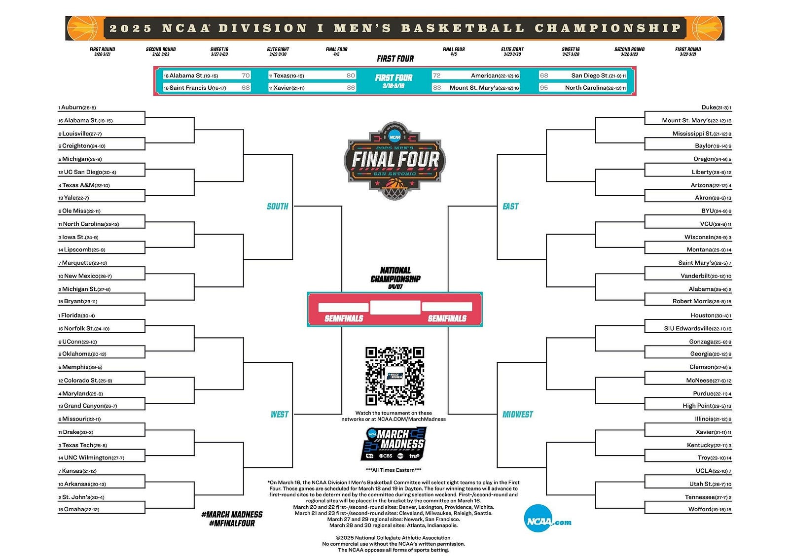

# NCAA March Madness Bracket Generator with Amazon Bedrock

This project tests different Amazon Bedrock models to determine which is best at predicting NCAA March Madness tournament outcomes for 2025. The system uses an agent-based approach where each model picks winners game by game, with access to team statistics to inform decisions.



## Models Tested

- **Claude 3.7 Sonnet** (anthropic.claude-3-7-sonnet-20240620-v1:0)
- **Llama 3.3 70B Instruct** (meta.llama3-70b-instruct-v1:0)
- **Mistral Large (24.02)** (mistral.mistral-large-2402-v1:0)
- **Amazon Nova Pro** (amazon.nova-pro-v1:0)

## Features

- Agent-based bracket generation with reasoning for each pick
- Access to real team statistics from ESPN, NCAA, and Sports Radar APIs
- Comparison of different Bedrock models' performance
- Detailed output with reasoning for each prediction
- JSON output of completed brackets for analysis

## Prerequisites

- Python 3.8+
- AWS account with access to Amazon Bedrock
- Permissions to use the Bedrock models listed above

## Installation

1. Clone this repository:
   ```
   git clone https://github.com/yourusername/march-madness-bedrock.git
   cd march-madness-bedrock
   ```

2. Install the required dependencies:
   ```
   pip install -r requirements.txt
   ```

3. Configure AWS credentials using AWS CLI or environment variables:
   ```
   aws configure
   ```
   Or set environment variables according to your operating system.

## Usage

Run the main script to generate brackets using all models:

```
python main.py
```

This will:
1. Load team statistics from JSON files in the `src/data/team_stats` directory
2. Create a tournament bracket structure based on current team rankings and regions
3. Use each model to predict winners for every matchup, with reasoning
4. Save the results to the `results` directory

To test a single model:

```
python run_single_model.py claude
```

Available model options: `claude`, `llama`, `mistral`, `nova`

Additional tools:
- `python visualize_results.py` - View bracket results in text format
- `python compare_models.py` - Compare predictions across models
- `python generate_report.py` - Generate a detailed markdown report

## Project Structure

```
.
├── main.py                 # Main script to run the bracket generation
├── requirements.txt        # Python dependencies
├── setup.py                # Setup script for the project
├── run_single_model.py     # Script to run a single model
├── compare_models.py       # Script to compare model predictions
├── generate_report.py      # Script to generate detailed reports
├── visualize_results.py    # Script to visualize bracket results
├── src/
│   ├── models/
│   │   ├── agent.py        # BracketAgent for making predictions
│   │   └── bedrock_client.py # Client for Amazon Bedrock models
│   ├── utils/
│   │   ├── bracket.py      # Bracket structure and generation
│   │   └── stats_retriever.py # Team statistics retrieval
│   └── data/               # Directory for data files
├── tests/                  # Test directory
│   ├── test_setup.py       # Tests for project setup
│   ├── test_stats_retriever.py # Tests for stats retriever
│   └── test_team_stats_loading.py # Tests for team stats loading
└── results/                # Output directory for generated brackets
```

## How It Works

1. **Team Statistics**: The system loads NCAA basketball team statistics from JSON files:
   - Individual team statistics files stored in `src/data/team_stats/`
   - Combined statistics file generated and stored as `src/data/team_stats_{year}.json`

2. **Bracket Structure**: A standard NCAA tournament bracket is created with 64 teams across 4 regions.

3. **Agent-Based Prediction**: For each matchup, the agent:
   - Retrieves statistics for both teams
   - Formats a prompt with the team information
   - Sends the prompt to the Bedrock model
   - Analyzes the response to extract the prediction and reasoning
   - Determines the winner and advances them in the bracket

4. **Model Comparison**: After all models have generated complete brackets, the results are compared to see which model made the most accurate predictions.

## Customization

- **Team Data**: The system loads team statistics from JSON files in the `src/data/team_stats/` directory.
  - You can add or modify team statistics by editing these files
- **Model Parameters**: Adjust temperature and other parameters in `src/models/bedrock_client.py`.
- **Prompt Engineering**: Modify the system prompt in `src/models/agent.py` to improve prediction quality.
- **Testing**: Run tests using the scripts in the `tests/` directory to verify functionality.

## Output

The system generates JSON files in the `results` directory:
- Individual bracket files for each model
- A combined results file with all models' predictions
- Each file includes the full bracket structure, predictions, and reasoning

## License

This project is licensed under the MIT License - see the LICENSE file for details.
